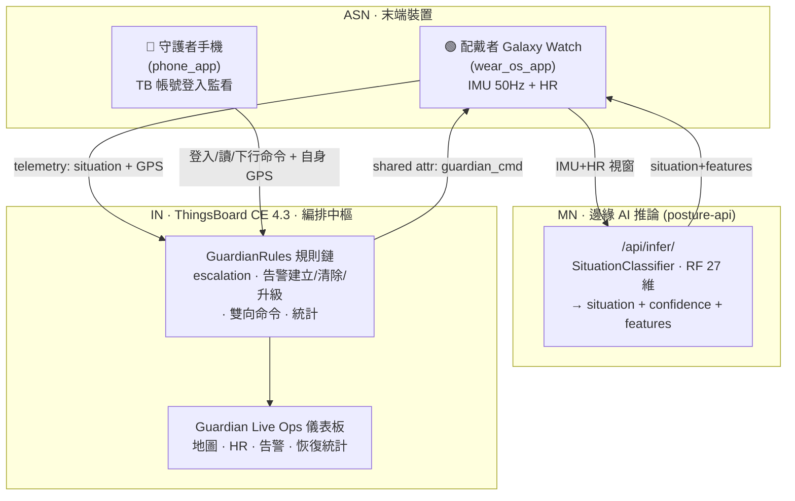
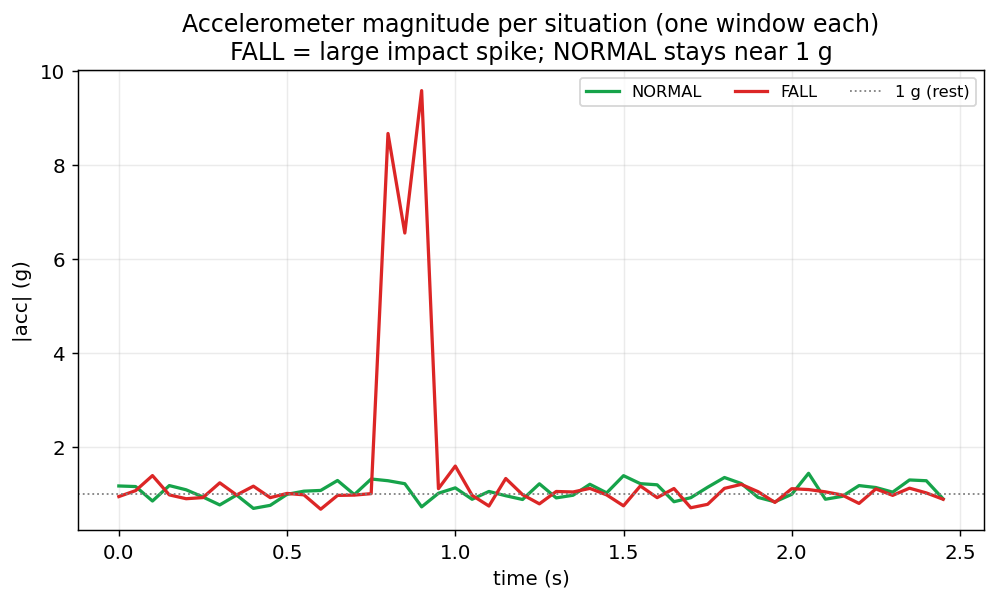
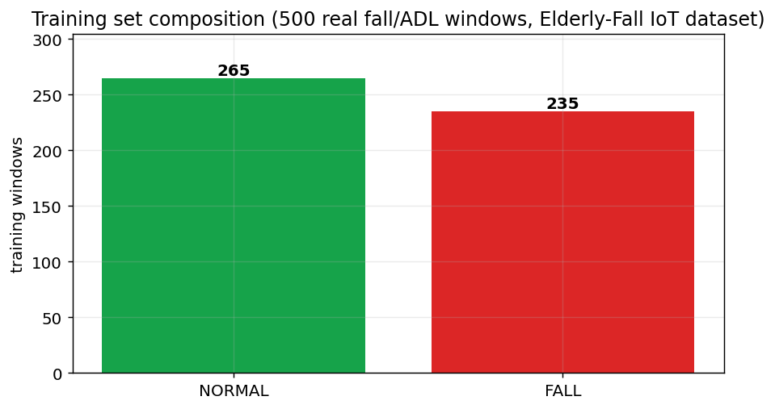
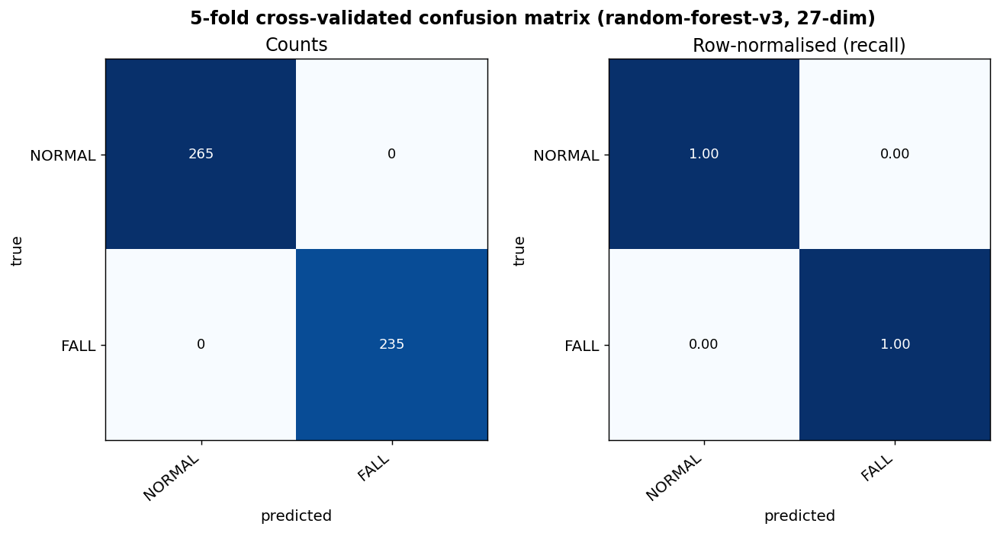
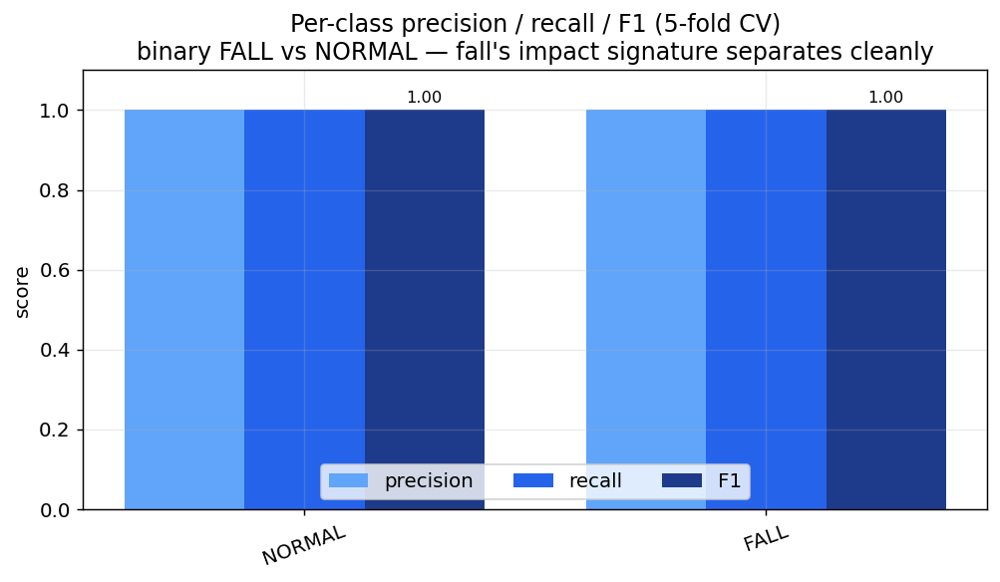
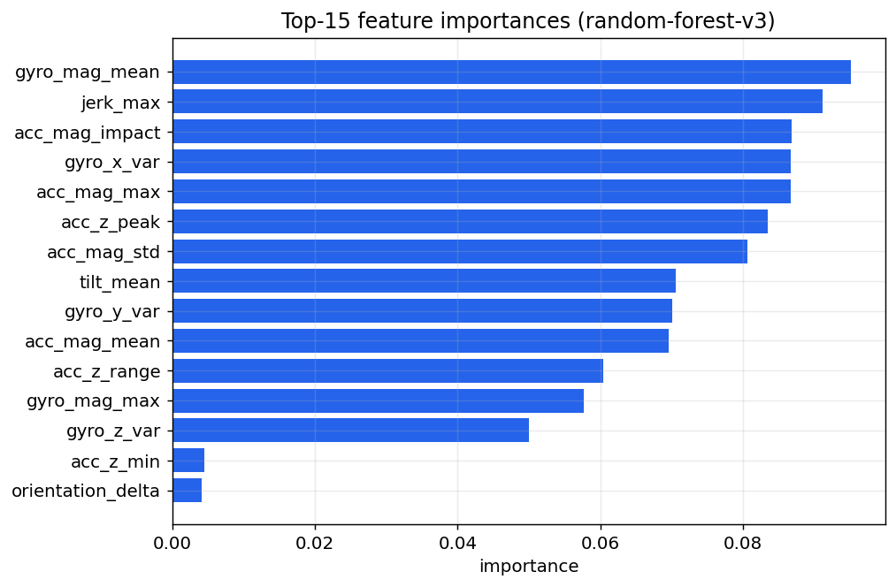

# 腕戴式「生理數位孿生守護者」· Wearable Guardian (v3.2)

> 以 **oneM2M 三層架構**為骨幹的穿戴式安全守護系統：
> **Galaxy Watch**（IMU 50 Hz + 心率）→ **FastAPI 邊緣 AI 推論**（多類別情境分類器 + 個人 HR 基線）
> → **ThingsBoard 雲端編排中樞**（規則鏈告警 + 護理戰情儀表板）。

本系統面向**高齡長者與居家照護**：手錶連續守護，偵測到**跌倒**時，由雲端規則鏈自動升級告警、即時通知守護者，並支援一鍵呼叫與派遣回手錶。情境分類器已從「全合成資料」改為 **真實跌倒資料集**（Kaggle *Elderly-Fall Detection IoT*）訓練 —— 跌倒／躺下／坐下／正常用真實標註事件；架構上 **TB 升級為編排中樞**，server 退化成單純的 AI 推論微服務。

| | |
| --- | --- |
| **架構** | oneM2M 三層：ASN 手錶/手機 · MN FastAPI 推論 · IN ThingsBoard 編排 |
| **模型** | `random-forest-v3`，27 維（15 IMU + 5 HR + 6 跌倒 + 1 HR 個人基線），4 類情境 |
| **訓練資料** | 500 筆真實跌倒/日常視窗（Kaggle *Elderly-Fall Detection IoT*） |
| **交叉驗證** | 5-fold CV **87.0%**（FALL / LIE_DOWN 近乎完美） |
| **雙角色** | 配戴者 Wearer（手錶）/ 守護者 Guardian（手機 TB 帳號登入） |

> 🧭 想看**完整的目標、設計理念、端到端資料流、TB 規則鏈拓樸與部署視圖**，請見 **[docs/architecture.md](docs/architecture.md)**（架構總文件，含多張圖）。

## 目錄

1. [專案概覽](#1-專案概覽)
2. [系統架構速覽](#2-系統架構速覽)
3. [護理戰情功能](#3-護理戰情功能)
4. [情境分類模型](#4-情境分類模型)
5. [情境與升級體系](#5-情境與升級體系)
6. [推論 API](#6-推論-api)
7. [一鍵啟動與 Demo](#7-一鍵啟動與-demo)
8. [開發者指南](#8-開發者指南)
9. [專案結構](#9-專案結構)
10. [文件索引](#10-文件索引)

---

## 1. 專案概覽

### 解決什麼問題

- **跌倒**：長者跌倒後若無人發現，黃金救援時間流失極快。手錶須能即時偵測倒地、判斷生命徵象、自動求救。

### 核心特色

- **邊緣 AI 多類別判讀**：不是單純門檻，而是訓練過的分類器把「坐下／躺下／跌倒」這些都帶撞擊特徵的動作分開（見 [§4](#4-情境分類模型)）。
- **關注點分離**：`API server = 純 AI 推論`、`ThingsBoard = 編排中樞`。升級判斷、告警建立/清除/升級、GPS、守護者訊息、雙向命令、統計全在 TB 規則鏈。
- **個人化 HR 基線**：以 EWMA 學每位配戴者的靜息心率，`hr_above_baseline` / `hr_max` 讓「跌倒後生命徵象驟變」的 `SOS_COLLAPSE` 判讀因人而異。
- **護理戰情**：守護者手機 TB 帳號登入監看、地圖附近優先、告警即時通知、一鍵呼叫／派遣回手錶（見 [§3](#3-護理戰情功能)）。
- **誠實的評估**：5-fold 交叉驗證、丟棄標籤洩漏特徵、如實回報 `SIT_DOWN` 的資料天花板（見 [§4.8](#48-誠實的限制給報告交代)）。

### 雙角色

| 角色 | 裝置 | 說明 |
| --- | --- | --- |
| **配戴者 Wearer** | Galaxy Watch（`wear_os_app`） | 被守護者，產生 IMU / HR / 情境 / GPS；本地偵測跌倒、SOS 倒數、接收守護者命令 |
| **守護者 Guardian** | 手機（`phone_app`） | 以 TB 帳號（CUSTOMER_USER）登入監看所有配戴者；無 BPM；可下行「呼叫／前往中」 |

---

## 2. 系統架構速覽



> **架構原則（v3.2）：API server = 純 AI 推論；ThingsBoard = 編排中樞。**
> server 只把 IMU+HR 視窗分類成 situation；**escalation 判斷、告警建立/清除/升級、GPS、守護者訊息、
> 雙向命令、統計全部在 TB 的 `GuardianRules` 規則鏈裡完成**。手錶把推論結果 + GPS 直接送 TB。

| 層 | 角色 | 元件 | 職責 |
| --- | --- | --- | --- |
| **IN** | 編排中樞 | ThingsBoard CE 4.3 `GuardianRules` + 儀表板 | 從 situation+features **算 escalation** → 建立/清除告警（NORMAL 自動 ClearAlarm）、`ASK_OK→20s 無回應→自動升級 COLLAPSE`、守護者命令（shared attr）→手錶、`ack_seen→rescue_state`、統計、通知 |
| **MN** | 純 AI 推論 | `posture-api/` FastAPI | `SituationClassifier` + 個人 HR 基線，**只回 `{situation, confidence, features}`** |
| **ASN** | 末端 | 手錶 `wear_os_app` / 手機 `phone_app` | 手錶 `/api/infer` 拿 situation → 把結果+GPS 直送 TB；手機 TB 帳號登入監看、上傳自身 GPS、下行「前往中」 |

> 📐 更詳細的元件圖、端到端序列圖、規則鏈拓樸圖與部署圖 → **[docs/architecture.md](docs/architecture.md)**。

---

## 3. 護理戰情功能

三項「更厲害但不花俏」的照護功能，全部用 ThingsBoard 原生能力，由 `scripts/provision_thingsboard.py` 一鍵佈建（已實機驗證）：

| 功能 | 說明 | 機制 |
| --- | --- | --- |
| **護理呼叫派發** | 配戴者觸發告警（倒地/跌倒）→ 守護者立刻收到 TB 鈴鐺通知派遣 | Notification Center（WEB；可開 Email/Teams）。target=`ORIGINATOR_ENTITY_OWNER_USERS` → 自動派給該配戴者所屬的守護者 |
| **數位分身 Avatar 卡片** | 每位配戴者一張卡：頭像圓圈 + 即時 HR + 狀態徽章，顏色隨情境（綠正常／青坐躺／橘疑似跌倒／紅倒地）即時變 | `cards.markdown_card` + JS value function（`data[0][key]`），單一實體 alias |
| **一鍵呼叫／派遣手錶** | 儀表板「📞 呼叫／🏃 指派」→ 手錶大聲響鈴+震動「守護者正在呼叫你」或顯示「守護者前往中」 | 原生 `two_segment_button` 寫 `guardian_cmd=call/dispatch` 到 `SHARED_SCOPE` → 手錶輪詢讀到 → `WearStage.called/acked` |

> 驗證：inject collapse → guardian1 收到「🚑 MedicalCollapse · critical」派遣通知；儀表板含配戴者的 avatar + 呼叫卡；
> 寫 `guardian_cmd=call` → 手錶用 device token 讀回 `call` → 響鈴觸發。完整節點形狀與踩雷見 [docs/architecture.md](docs/architecture.md) §5 與 [docs/progress-dual-role.md](docs/progress-dual-role.md)。

---

## 4. 情境分類模型

本專案的 **AI 核心**。

### 4.1 為什麼非 ML 不可

`SIT_DOWN`／`LIE_DOWN`／`FALL` 的加速度都帶「撞擊」特徵，純門檻會誤報爆量；只有訓練過的分類器才分得開。
升級（escalation）才是規則層，與 ML 職責分離。

### 4.2 資料集（Kaggle: *Elderly-Fall Detection IoT*）

- `data/dataset/fall_detection.csv`：**500 序列 × 50 timestep**，10 種標註動作，含 **5 種跌倒子型**（前/後/左/右/癱倒）+ 躺下/坐下/站/走/彎腰。
- 來源是 Montreal「Multiple Cameras Fall」影片集衍生的**模擬** IoT 感測資料（非真手錶錄製）。
- 對應到本專案 4 類：5 種 fall → `FALL`、lie_down → `LIE_DOWN`、sit → `SIT_DOWN`、stand/walk/bend → `NORMAL`。
- **心率**：資料集無心率，故每個視窗合成同分佈的靜息 HR（不洩漏標籤）；跌倒後的 `SOS_COLLAPSE` 仍可由 `hr_max` / `hr_above_baseline` 判讀。

### 4.3 訊號特性（為何 FALL 好分、靜態姿態難分）



跌倒有明顯的衝擊尖峰（~10 g），其餘情境都貼著 1 g。靜態姿態（坐/站/躺/正常）動作量都很低 → 只能靠傾角區分。

### 4.4 訓練資料組成



### 4.5 特徵（27 維）

| 群組 | 維度 | 內容 |
| --- | --- | --- |
| IMU | 15 | acc z 峰/谷/範圍、acc 量級 mean/std/max、gyro 三軸變異、gyro 量級、twist、傾角 mean/max、時長 |
| HR | 5 | hr mean/max/range/delta_max/sd |
| 跌倒 | 6 | 自由落體低點、撞擊尖峰、最大 jerk、落體→撞擊時間、撞擊後靜止度、傾角變化 |
| 個人基線 | 1 | hr_above_baseline（相對個人 HR 基線） |

> **工程關鍵**：資料集 accel 是「去重力」線性加速度，我們用 pitch/roll **重建含重力訊號**（`app/fall_dataset.py`），
> 讓它與真手錶 + 既有 27 維特徵管線一致 → **手錶 app 與 schema 完全不需改**。

### 4.6 訓練成果（5-fold 交叉驗證，誠實數字）





| 情境 | precision | recall | F1 | 備註 |
| --- | --- | --- | --- | --- |
| `FALL` | 1.00 | **1.00** | 1.00 | 撞擊尖峰極好分（安全關鍵類） |
| `LIE_DOWN` | 1.00 | **0.98** | 0.99 | 傾角 ~45° 可分 |
| `NORMAL` | 0.76 | 0.88 | 0.81 | 含站/走/彎腰 |
| `SIT_DOWN` | 0.38 | **0.21** | 0.27 | ⚠️ sit≈stand，見下 |
| **整體 accuracy** | | **0.87** | | 5-fold CV 平均 |

### 4.7 特徵重要性



### 4.8 誠實的限制（給報告交代）

- **sit ≈ stand**：在手錶可得的所有通道（accel/gyro/傾角）統計上完全相同（二分類探針 CV=0.46，等同亂猜）
  → `SIT_DOWN` 召回率天生偏低、會被歸成 `NORMAL`。**我們沒有用洩漏特徵硬拉高。**
- **環境感測器丟棄**：原始資料的 `floor_vibration / room_occupancy / pressure_mat` 是標籤洩漏（非跌倒恆=1、跌倒恆=0），
  且手錶根本沒有 → 全部不用，只訓練「手錶能重現」的 accel + gyro。
- **HR 不可洩漏標籤**：四個類別共用同一靜息 HR 分佈，HR 不參與情境分類；HR 只在升級層（`FALL` + 高 HR / 撞擊後靜止 → `SOS_COLLAPSE`）使用。
- **領域落差**：資料集是影片衍生模擬，靜息噪聲比真手錶大；可信賴的可轉移訊號是「跌倒衝擊量級」。

---

## 5. 情境與升級體系

| 情境 `situation` | 意義 | 升級 `escalation`（TB 規則鏈算） |
| --- | --- | --- |
| `NORMAL` | 站／走／正常 | `NONE` |
| `SIT_DOWN` | 坐下（良性） | `NONE` |
| `LIE_DOWN` | 躺下（良性） | `NONE` |
| `FALL` | 跌倒 | `ASK_OK`（手錶倒數 15s）→ 20s 無回應 `SOS_COLLAPSE` |
| `FALL` + HR 崩潰 | 倒地·生命徵象驟變 | `SOS_COLLAPSE`（直接 SOS） |

升級判斷**在 TB `GuardianRules` 的 JS node**：`FALL` 且 `hr_above_baseline>40`／`hr_max>150`／撞擊後持續靜止 → `SOS_COLLAPSE`，否則 `ASK_OK`。手錶端只保留同門檻的本地 hint 驅動自身 UI（含 15s 倒數），權威判定以 TB 為準（含 20s 無回應自動升級的伺服端安全網）。

---

## 6. 推論 API

server 只剩 AI 推論：

| Method | Path | 用途 |
| --- | --- | --- |
| GET | `/health` | 健康檢查、`model_source`、已載入 wearer token 數 |
| POST | `/api/infer` | **唯一核心**：IMU+HR 視窗 → `{situation, situation_confidence, proba, features}` |
| POST | `/api/evaluate_lift` | `/api/infer` 的相容別名（舊手錶版） |
| POST | `/api/demo/inject` | demo-only：**回放真實資料集視窗** → 推論 → 送 wearer 的 TB 裝置，讓規則鏈跑完整管線 |
| POST/GET | `/api/training`、`/api/training/rebuild`、`/api/training/stats` | 情境標籤資料上傳 / 重訓 / 統計 |

GPS、escalation、告警、守護者訊息、雙向命令、統計皆由 ThingsBoard 處理（見 [§2](#2-系統架構速覽)）。
請求／回應 schema 與 TB telemetry 鍵 → [docs/architecture.md](docs/architecture.md) §7。

---

## 7. 一鍵啟動與 Demo

```powershell
# 1. 啟動 ThingsBoard (IN) + posture-api (MN)
docker compose up -d --build

# 2. 用真實跌倒資料集訓練情境模型（→ data/models/posture_classifier.joblib, random-forest-v3）
.\.venv\Scripts\python.exe scripts\train_fall_model.py

# 3. 用 API 一鍵 provision ThingsBoard（雙角色 + 編排規則鏈 + 儀表板 + 護理通知）
#    預設單一配戴者 W-001；要多人就 --wearers W-001,W-002,...（其餘 Wearer_* 會被移除）
.\.venv\Scripts\python.exe scripts\provision_thingsboard.py

# 4. 套用模型到運行中的服務（資料 volume 即時生效；或熱重建）
Invoke-RestMethod -Method Post http://localhost:8000/api/training/rebuild
Invoke-RestMethod http://localhost:8000/health   # model=random-forest-v3, tb_workers_loaded=1

# 5. 無手錶情況下，一鍵注入各情境（回放真實視窗 → 推論 → 送 TB → TB 算 escalation+告警）
$base="http://localhost:8000"
"normal","sit","lie","fall","collapse" | % { Invoke-RestMethod -Method Post "$base/api/demo/inject?scenario=$_&worker_id=W-001" }
```

預期（TB 端自行算出）：`normal/sit/lie → NONE`；`fall → ASK_OK`（FallSuspected，20s 無回應自動升 MedicalCollapse）；
`collapse → SOS_COLLAPSE`（MedicalCollapse）。配戴者恢復 NORMAL 時告警自動 CLEARED（留 clearTs 供統計）。

| 服務 | URL |
| --- | --- |
| ThingsBoard Web UI | <http://localhost:18080>（`tenant@thingsboard.org` / `tenant`） |
| FastAPI Swagger | <http://localhost:8000/docs> |
| MQTT (TB) | `localhost:1883` |

> **部署提醒**：posture-api 是 docker image（`COPY app ./app`），`data/` 是 volume。
> 改**模型/資料** → 寫進 `data/` 即時生效（或 `/api/training/rebuild`）；改 **Python 程式** → `docker compose up -d --build posture-api` 重建映像。

---

## 8. 開發者指南

### 8.1 重新訓練 / 評估 / 出圖

```powershell
.\.venv\Scripts\python.exe scripts\train_fall_model.py    # 重訓並存檔
.\.venv\Scripts\python.exe scripts\eval_fall_model.py     # 誠實 5-fold CV + 各項檢查
.\.venv\Scripts\python.exe scripts\make_figures.py        # 重新產生 docs/img/*.png
# 套用到運行中服務：
Invoke-RestMethod -Method Post http://localhost:8000/api/training/rebuild
```

`model_source` 會是 `random-forest-v3`（27 維；改 `FEATURE_NAMES` 後不相容的舊模型會被自動丟棄）。

### 8.2 安裝配戴者手錶 App

```powershell
adb connect <watch-IP>:5555
cd wear_os_app; flutter build apk --debug; flutter install
```

點圓鈕開始錄製 → 本地偵測「自由落體→撞擊」自動觸發；`ASK_OK` 全螢幕 15 秒倒數、`SOS_COLLAPSE` 直接 SOS、收到守護者命令顯示「守護者前往中／正在呼叫你」。設定可填 MN URL / Wearer / TB Token。
**完整行為、狀態機、設定 → [wear_os_app/README.md](wear_os_app/README.md)。**

### 8.3 安裝守護者手機 App

```powershell
adb connect <phone-ip>:5555
cd phone_app; flutter pub get; flutter build apk --debug; flutter install
```

登入 TB（`guardian1@guardian.local`，密碼見 provision 設定）→ 三 Tab（配戴者 / 地圖 / 告警）；上傳自己 GPS；對告警中的配戴者按「我看到了·前往中」下行命令。
**完整功能、Tab 與下行命令 → [phone_app/README.md](phone_app/README.md)。**

---

## 9. 專案結構

```text
iot/
├── docker-compose.yml             # Postgres + ThingsBoard CE 4.3 + posture-api
├── posture-api/                   # MN — FastAPI 純 AI 推論
│   ├── Dockerfile
│   └── app/
│       ├── main.py                # /api/infer · /api/demo/inject · /api/training*
│       ├── schemas.py             # InferRequest / InferResponse 等
│       ├── features.py            # 27 維特徵
│       ├── classifier.py          # SituationClassifier（多類別 RandomForest）
│       ├── baseline.py            # 個人 HR 基線（EWMA）
│       ├── fall_dataset.py        # ★ 真實資料集載入/重力重建/HR/demo 回放（訓練與 demo 共用）
│       ├── synth.py               # 合成情境（demo 注入：normal/sit/lie/fall/collapse）
│       ├── training_store.py      # 情境標籤訓練資料磁碟存取
│       └── tb_client.py           # ThingsBoard HTTP push + wearer token bridge
├── wear_os_app/                   # ASN — Galaxy Watch：連續守護 + SOS 倒數 + 守護者前往中
├── phone_app/                     # ASN — 守護者控制中心（TB 帳號登入 / 地圖 / 告警 / 下行）
├── scripts/
│   ├── train_fall_model.py        # ★ 用真實跌倒資料集重訓
│   ├── eval_fall_model.py         # 5-fold CV + 跨分佈 + sit/stand 探針 + demo 回放檢查
│   ├── make_figures.py            # 產生 README 圖表 → docs/img/
│   ├── verify_live.py             # 對運行中服務做活體推論驗證
│   ├── provision_thingsboard.py   # 用 API 佈建 device + GuardianRules + 儀表板 + 通知
│   ├── install_wear_os_app.ps1    # 手錶安裝輔助
│   └── watch_logcat.ps1           # 手錶 logcat 輔助
├── data/
│   ├── dataset/fall_detection.csv # 真實跌倒資料集（CSV；原始影片已清掉，留 technicalReport.pdf）
│   ├── posture_training/          # 訓練視窗（真實 fall/日常資料集）
│   ├── models/                    # random-forest-v3 (.joblib) + 合成版備份
│   ├── worker_tokens.json         # wearer_id → TB device token
│   └── guardian_tokens.json       # 守護者 device token（承載守護者 GPS）
└── docs/
    ├── architecture.md            # ★ 架構總文件（目標/三層/資料流/規則鏈/部署，含多張圖）
    ├── progress-dual-role.md      # 工程進度與決策日誌（含資料集重訓細節）
    ├── dashboard-mockup.html      # 儀表板設計 mockup（瀏覽器可開）
    └── img/                       # README 圖表（混淆矩陣、訊號、特徵重要性…）
```

---

## 10. 文件索引

- **[docs/architecture.md](docs/architecture.md)** — 架構總文件：專案目標與動機、oneM2M 三層、元件詳述、端到端資料流（序列圖）、TB `GuardianRules` 規則鏈拓樸、ML 子系統、資料模型與介面、部署視圖、設計決策與取捨、詞彙表。
- [docs/progress-dual-role.md](docs/progress-dual-role.md) — 工程進度與決策日誌（雙角色、架構搬遷、**2026-06-02 真實資料集重訓**含坑與限制、護理戰情升級、儀表板迭代）。
- [docs/img/](docs/img/) — 訓練成果圖表（由 `scripts/make_figures.py` 產生）。
- [wear_os_app/README.md](wear_os_app/README.md) — 配戴者手錶 App 說明。
- [phone_app/README.md](phone_app/README.md) — 守護者手機 App 說明。
