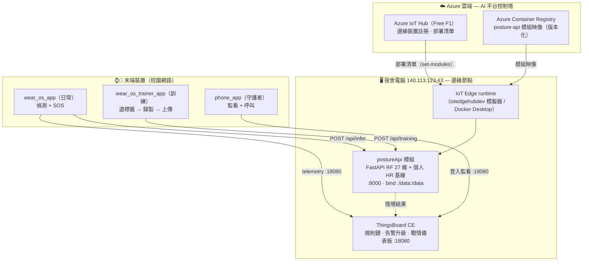
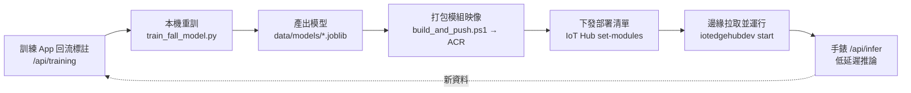
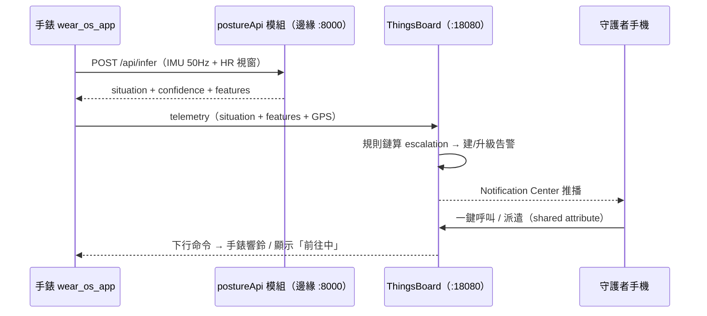

# AI Platform 架構報告 · Azure IoT Edge（Edge MLOps）

> 本報告說明本專題「腕戴式跌倒守護者」如何以 **Azure IoT Edge** 作為 **AI platform**：
> 由 Azure 雲端集中管理、把 AI 推論模組部署到邊緣節點，搭配兩支手錶 App 的訓練／日常分工，
> 形成可運作、可更新、可在校園網路實機展示的 **Edge MLOps** 系統。
>
> 系統總架構（三層、規則鏈、模型細節）見 [architecture.md](architecture.md)；本報告聚焦 **AI 平台 / 雲端 / 邊緣部署** 這一層。
> 操作步驟見 [../cloud/azure/README-azure.md](../cloud/azure/README-azure.md)。

## 目錄

1. [摘要](#1-摘要)
2. [什麼是 AI platform，本專案如何滿足](#2-什麼是-ai-platform本專案如何滿足)
3. [平台選型決策](#3-平台選型決策)
4. [總體架構](#4-總體架構)
5. [元件職責](#5-元件職責)
6. [Edge MLOps 生命週期](#6-edge-mlops-生命週期)
7. [雙手錶 App 與資料回流](#7-雙手錶-app-與資料回流)
8. [端到端資料流](#8-端到端資料流)
9. [Demo 網路策略](#9-demo-網路策略)
10. [成本與安全](#10-成本與安全)
11. [限制與未來工作](#11-限制與未來工作)
12. [附錄：檔案與指令對照](#12-附錄檔案與指令對照)

---

## 1. 摘要

本系統以 **oneM2M 三層架構**為骨幹（末端裝置 / 邊緣推論 / 雲端編排）。為滿足專題「需有一個 **AI platform**」的要求，導入 **Azure IoT Edge**：

- **Azure IoT Hub（控制平面）** 集中註冊邊緣裝置、保存「部署清單」並把 **AI 推論模組**（`posture-api`）下發到邊緣節點。
- **Azure Container Registry（ACR）** 作為 AI 模組映像的版本化倉庫。
- **邊緣節點 = 宿舍電腦（IP `140.113.123.43`）**，永遠開機、校園可達；模組在此低延遲推論，ThingsBoard 也在此編排告警。

AI 平台的價值不在「每次推論」，而在 **把 AI 模型的生命週期（打包 → 版本化 → 部署 → 更新）制度化**。推論在邊緣執行，是 Edge AI 的刻意設計（低延遲、可離線）。

| 項目 | 內容 |
| --- | --- |
| AI 平台 | Azure IoT Edge（IoT Hub + ACR + IoT Edge runtime） |
| 邊緣節點 | 宿舍電腦 `140.113.123.43`（Windows 11 家用版 → iotedgehubdev 模擬器） |
| AI 模組 | `posture-api`（RandomForest 27 維情境分類器，5-fold CV ≈ 89.5%） |
| 訓練 | 本機 `scripts/train_fall_model.py`（真實跌倒資料集） |
| 資料回流 | `wear_os_trainer_app` → `/api/training` → 擴充訓練集 |

---

## 2. 什麼是 AI platform，本專案如何滿足

在 MLOps 語境下，一個「AI / ML 平台」負責 **AI 模型生命週期的工程化**，而非親自跑每一次推論：

| 平台職責 | 本專案的實現 |
| --- | --- |
| 模型/服務**打包**為可部署單位 | `posture-api` 容器（重用既有 `Dockerfile`）＝ IoT Edge **模組** |
| 模型版本**儲存／倉庫** | **Azure Container Registry**（模組映像 tag 版本） |
| **集中部署**到目標節點 | **Azure IoT Hub** 下發「部署清單」到 IoT Edge 裝置 |
| **遠端管理／更新** | IoT Hub `set-modules`：改清單即可換版本、回滾 |
| **持續更新閉環** | 訓練 App 回流標註 → 重訓 → 重建映像 → 重新部署（見 §6） |

> **誠實定位（給報告交代）**：本專案採**精簡範圍**——平台負責「把 AI 模組部署／管理到邊緣」這條 **Edge AI 部署生命週期**；**模型訓練維持在本機腳本**。這是一個聚焦、完整、可運作的 Edge MLOps 子集，而非把訓練也搬上雲（後者屬未來工作，見 §11）。

一句話定位：**邊緣是「部署目標」，Azure IoT Edge 是「把 AI 模組送上邊緣並持續管理的控制塔」。**

---

## 3. 平台選型決策

| 候選 | 結論 | 理由 |
| --- | --- | --- |
| 純本機 docker（現況） | ✗ 不算平台 | 只是手動 `docker build`，無版本倉庫、無集中部署 |
| GCP Vertex AI | ✗ 已棄用 | Cloud IoT Core 2023 下線，**無託管 cloud→edge 部署**，邊緣只能手動 `docker pull` |
| **Azure IoT Edge** | ✅ 採用 | **原生「雲端→邊緣」託管部署**：IoT Hub 下發、ACR 倉庫、可遠端管理／更新；最貼「Edge MLOps」 |

**邊緣 runtime 的取捨**：目標機是 **Windows 11 家用版 → 無 Hyper-V → 不能用 EFLOW**（Azure IoT Edge for Linux on Windows）。因此採 **iotedgehubdev 模擬器**（靠現有 Docker Desktop），足以展示「部署清單 → 模組在邊緣運行」的完整概念。

---

## 4. 總體架構

對應 oneM2M 三層：**ASN**＝手錶/手機；**MN**＝`postureApi` 邊緣模組；**IN**＝ThingsBoard。Azure IoT Edge 疊在 MN 之上，負責「把 MN 的 AI 模組部署到邊緣節點並管理」。

---

## 5. 元件職責

| 元件 | 層 | 職責 |
| --- | --- | --- |
| **Azure IoT Hub** | 雲端 | 註冊 IoT Edge 裝置；保存／下發部署清單；遠端管理（portal 可見模組清單） |
| **Azure Container Registry** | 雲端 | 儲存 `posture-api` 模組映像（版本 tag），邊緣由此拉取 |
| **IoT Edge runtime（模擬器）** | 邊緣 | 依部署清單拉映像、起 `edgeAgent`/`edgeHub`/`postureApi` 模組 |
| **postureApi 模組** | 邊緣 | **AI 推論**：IMU+HR 視窗 → 情境（RF 27 維）+ 信心 + 特徵；`/api/infer`、`/api/training`、`/api/demo/inject` |
| **ThingsBoard CE** | 邊緣（雲端編排角色） | 規則鏈 escalation、告警建立/清除/升級、戰情儀表板、雙向命令 |
| **wear_os_app** | 末端 | 日常偵測 + SOS，只顯示結果 |
| **wear_os_trainer_app** | 末端 | 採集標註資料餵 `/api/training`（模型工廠的資料前端） |
| **phone_app** | 末端 | 守護者監看、一鍵呼叫/派遣 |

> 設計原則：**新增不破壞**。AI 模組重用既有 `posture-api/Dockerfile`；模型以 `./data` 掛載進模組；後端 schema、ThingsBoard、手錶採集邏輯皆未改。

---

## 6. Edge MLOps 生命週期

| 階段 | 動作 | 工具 |
| --- | --- | --- |
| 資料 | 訓練 App 採集標註視窗 | `wear_os_trainer_app` → `/api/training` |
| 訓練 | 真實跌倒資料 → RF | `scripts/train_fall_model.py` |
| 打包 | 模組映像 → ACR | `cloud/azure/build_and_push.ps1` |
| 部署 | 產生並下發清單 | `gen_deployment.ps1` + `run_edge.ps1 -SetModules` |
| 運行 | 邊緣拉取＋啟動模組 | `iotedgehubdev start` |
| 更新 | 重訓→重建→重部署（bind-mount 下重啟即生效） | 同上循環 |

模型細節（27 維特徵、5 類情境、5-fold CV 89.5%、`SIT_DOWN` 資料天花板）見 [architecture.md §6](architecture.md) 與圖：
[混淆矩陣](img/confusion_matrix.png) · [各類指標](img/per_class_metrics.png) · [特徵重要性](img/feature_importance.png)。

---

## 7. 雙手錶 App 與資料回流

把「訓練」與「日常使用」拆成兩支獨立可並裝的 App，對應 AI 平台的「資料採集前端」與「部署產品」：

| App | applicationId | 角色 | 主要動作 |
| --- | --- | --- | --- |
| **wear_os_trainer_app** | `com.smartwarehouse.wear_os_trainer` | 模型工廠的**標註資料採集前端** | 選標籤（NORMAL/SIT/LIE/FALL）→ 錄 5s → `POST /api/training`；顯示 `/api/training/stats` 覆蓋度 |
| **wear_os_app** | `com.smartwarehouse.wear_os_app` | 部署出去的**日常產品** | `POST /api/infer` 偵測 + SOS 升級 + 守護者聯動，只顯示結果 |

兩支重用同一套原生心率模組（Health Services `MainActivity.kt`）與 50Hz IMU 採集邏輯；不同 `applicationId` 讓兩者可在同一支手錶並存安裝。

---

## 8. 端到端資料流

推論在**邊緣模組**完成（低延遲、可離線）；escalation 與告警編排在 **ThingsBoard**；AI 平台（Azure）不在即時路徑上，而是負責「模組怎麼上到邊緣、怎麼更新」。

---

## 9. Demo 網路策略

**問題**：學校 WiFi 常開「AP 用戶端隔離」，同一 AP 的兩台裝置互看不到 → 會擋手錶連筆電 `:8000`，也擋 ThingsBoard `:18080`。此問題與雲端選擇無關。

**解法（已採用）**：邊緣節點是**宿舍電腦的校園路由 IP `140.113.123.43`**。手錶連它是「經校園路由到伺服器」，而非「同一 AP 的兩台 client 互連」，**不受用戶端隔離影響**。

| 路線 | 內容 | 風險 |
| --- | --- | --- |
| **主力（live）** | 手錶/手機 → `140.113.123.43:8000`（模組）+`:18080`（TB），走校園網路 | 需 8000/18080 入站放行、IP 穩定 |
| **保險（注入）** | `POST /api/demo/inject?scenario=collapse` 在宿舍電腦本機灌情境，戰情儀表板用該機瀏覽器演完整告警升級 | 零外部依賴，絕不出包 |

**Demo 前必做**：① `open_firewall.ps1` 放行入站 8000/18080；②確認 `140.113.123.43` 穩定；③**用手機連教室 WiFi 實測 `http://140.113.123.43:8000/health`**，通了走主力、不通走保險。

---

## 10. 成本與安全

| 項目 | 說明 |
| --- | --- |
| **IoT Hub F1** | 永久免費層（8000 訊息/日，每訂閱 1 個），足夠 demo |
| **ACR Basic** | 小額月費；demo 後可 `az acr delete` |
| **模擬器 / Docker** | 免費；無「不歸零」計費資源 |
| **憑證** | ACR 密碼、Edge 連線字串寫入 `cloud/azure/.env`（不入版控） |
| **網路曝露** | 邊緣節點僅開放必要埠（8000/18080）；推論為內網/校園網流量 |

---

## 11. 限制與未來工作

| 限制 | 說明 / 未來方向 |
| --- | --- |
| **Windows 家用版無 EFLOW** | 採 iotedgehubdev **模擬器**（dev 工具，非生產 runtime）；升級路徑：WSL2 安裝 `aziot-edge` 真實 runtime |
| **訓練在本機** | 精簡範圍；未來可接 Azure ML 做雲端訓練/實驗追蹤/模型註冊表，形成完整 CT 管線 |
| **模型以 bind-mount 進模組** | 同機 demo 最省事；要部署到別台再改成 build 階段 baked 進映像 |
| **`SIT_DOWN` 召回率低** | sit≈stand 為資料天花板（非程式 bug），已誠實揭露 |

---

## 12. 附錄：檔案與指令對照

| 檔案（`cloud/azure/`） | 作用 | 指令 |
| --- | --- | --- |
| `setup_azure.ps1` | 建 RG / IoT Hub F1 / Edge 裝置 / ACR，寫 `.env` | `.\cloud\azure\setup_azure.ps1` |
| `build_and_push.ps1` | build 模組映像 → 推 ACR | `.\cloud\azure\build_and_push.ps1` |
| `deployment.template.json` | IoT Edge 部署清單模板 | — |
| `gen_deployment.ps1` | 代入 `.env` → `deployment.generated.json` | `.\cloud\azure\gen_deployment.ps1` |
| `run_edge.ps1` | 模擬器 setup + start（+`-SetModules` 推 IoT Hub） | `.\cloud\azure\run_edge.ps1 -SetModules` |
| `open_firewall.ps1` | 放行入站 8000/18080（系統管理員） | `.\cloud\azure\open_firewall.ps1` |
| `README-azure.md` | 完整 runbook | — |

**驗證清單**：`az iot hub device-identity list` 見 edge 裝置；ACR 有 `posture-api` 映像；`docker ps` 見 `postureApi`+`edgeHub`；`scripts/verify_live.py` 打 `:8000/api/infer` 回傳分類；portal IoT Hub → Devices → Modules 出現 `postureApi`（截圖佐證）。

---

> 相關文件：總架構 [architecture.md](architecture.md) · 工程決策日誌 [progress-dual-role.md](progress-dual-role.md) · 操作 runbook [../cloud/azure/README-azure.md](../cloud/azure/README-azure.md)
