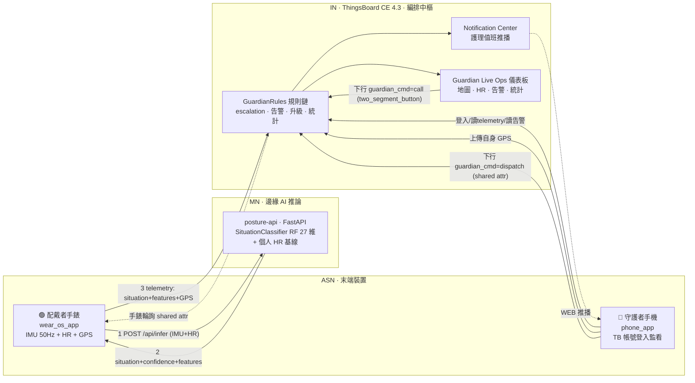
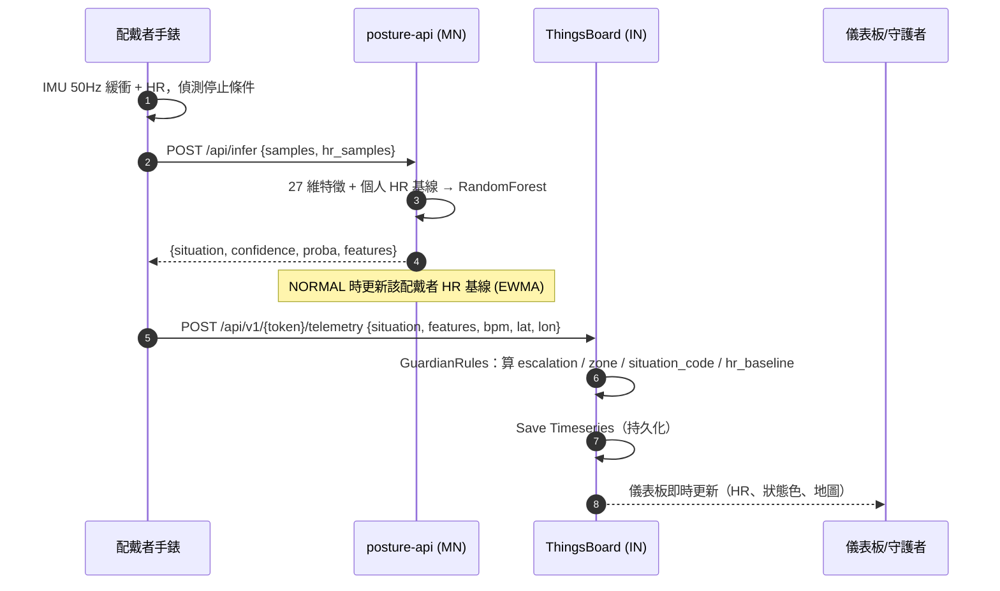
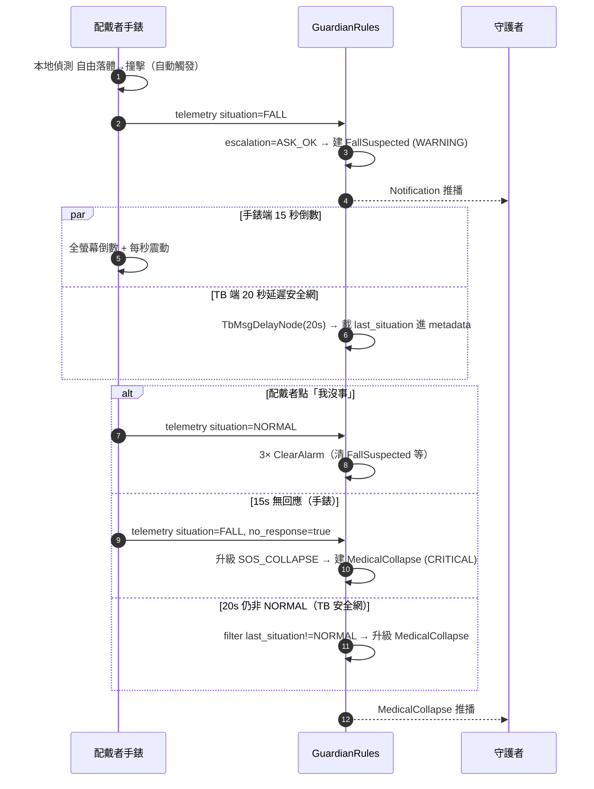
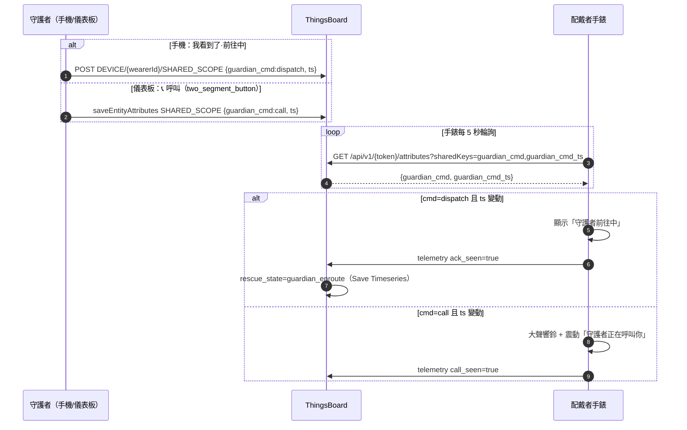
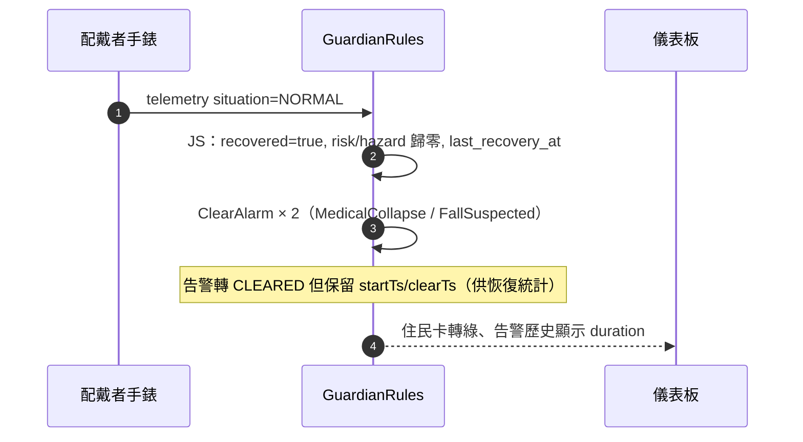
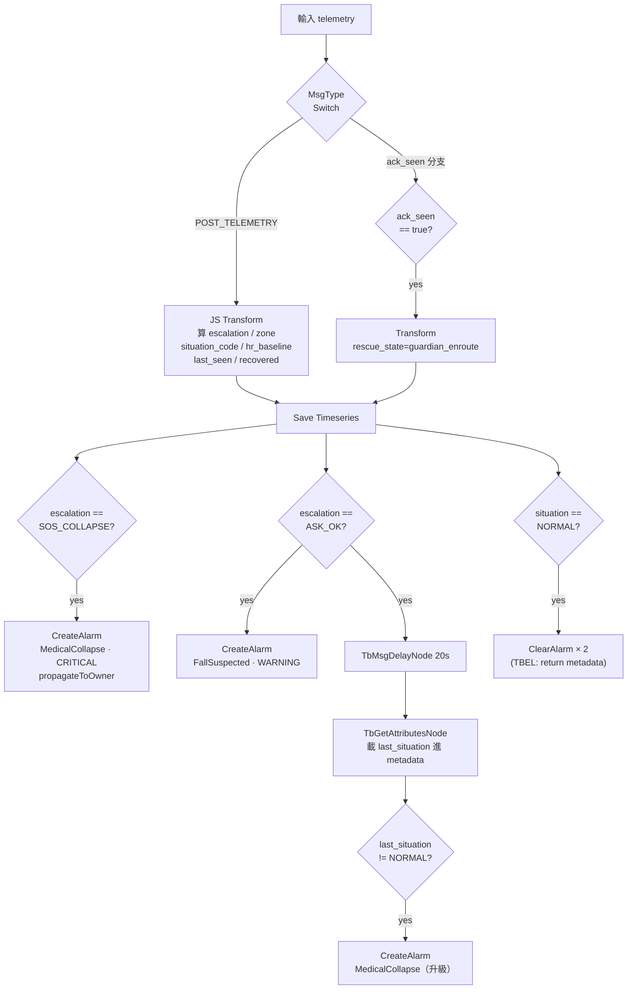
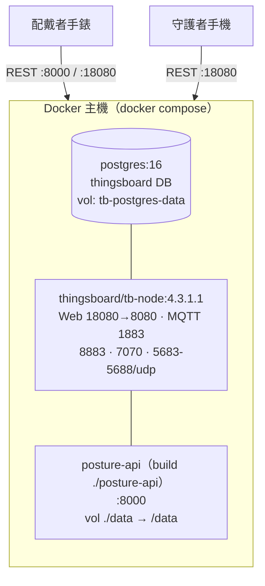

# 系統架構文件 · Wearable Guardian (v3.2)

> 腕戴式「生理數位孿生守護者」— 完整說明**專案目標與內容**：三層架構、各元件職責、端到端資料流、
> ThingsBoard 編排規則鏈、ML 子系統、資料模型、部署視圖、設計決策與取捨。
>
> 入門與快速啟動見 [../README.md](../README.md)；逐日工程決策與踩雷見 [progress-dual-role.md](progress-dual-role.md)。

## 目錄

1. [專案目標與動機](#1-專案目標與動機)
2. [總體架構](#2-總體架構)
3. [元件詳述](#3-元件詳述)
4. [端到端資料流](#4-端到端資料流)
5. [ThingsBoard 編排中樞](#5-thingsboard-編排中樞)
6. [ML 子系統](#6-ml-子系統)
7. [資料模型與介面](#7-資料模型與介面)
8. [部署與執行視圖](#8-部署與執行視圖)
9. [設計決策與取捨](#9-設計決策與取捨)
10. [詞彙表與參考](#10-詞彙表與參考)

---

## 1. 專案目標與動機

### 1.1 問題背景

| 風險 | 情境 | 為何難 |
| --- | --- | --- |
| **跌倒** | 高齡長者跌倒、無人即時發現 | 黃金救援時間流失極快；坐下/躺下/跌倒在加速度上都帶撞擊特徵，純門檻難分 |

### 1.2 目標

打造一套**端到端可運作、可佈建、可誠實評估**的穿戴式守護系統：

1. 手錶連續守護，邊緣 AI 把 IMU + HR 視窗判讀成**情境**（跌倒／坐／躺／正常）。
2. 雲端依情境 + 生理特徵**自動升級告警**，即時通知守護者並支援雙向互動（呼叫／派遣）。
3. 模型用**真實跌倒資料集**訓練、以交叉驗證**誠實回報**，不靠標籤洩漏特徵灌水。

### 1.3 為何選這套架構

| 選擇 | 理由 |
| --- | --- |
| **oneM2M 三層**（ASN / MN / IN） | 對應「末端裝置／邊緣推論／雲端編排」的標準水平架構，職責清楚、可替換 |
| **邊緣 AI 微服務**（FastAPI） | 推論無狀態、易測試、可獨立重訓與熱重建，不與業務邏輯耦合 |
| **ThingsBoard 當編排中樞** | 告警/清除/升級/通知/儀表板/雙向命令全用平台原生能力，零自建後端 |

### 1.4 專案亮點

- **關注點分離**：`API = 純 AI 推論`、`TB = 編排中樞`（單一 escalation 真相來源）。
- **個人化**：EWMA 學每位配戴者靜息 HR，`hr_above_baseline` 讓「跌倒後生命徵象驟變」的 `SOS_COLLAPSE` 升級判讀因人而異。
- **真實資料 + 工程巧思**：重力重建讓資料集訊號與真手錶／既有特徵管線一致，**手錶 app 與 schema 完全不需改**。
- **研究誠實度**：丟棄標籤洩漏特徵、如實揭露 `sit≈stand` 的資料天花板。

---

## 2. 總體架構



### 2.1 oneM2M 三層對應

| oneM2M 層 | 本專案元件 | 職責 | 不負責 |
| --- | --- | --- | --- |
| **ASN**（Application Service Node） | `wear_os_app`（手錶）、`phone_app`（手機） | 感測採集、呼叫推論、送 telemetry、監看、下行 | 不算告警升級（手錶只留本地 UI hint） |
| **MN**（Middle Node） | `posture-api`（FastAPI + RandomForest） | **只**把 IMU+HR 視窗 → `{situation, confidence, features}` | 不算 escalation、不建告警、不存 GPS、不發訊息 |
| **IN**（Infrastructure Node） | ThingsBoard CE 4.3 | escalation、告警建立/清除/升級、雙向命令、統計、通知、儀表板 | 不做 ML 推論 |

### 2.2 關注點分離原則（v3.2 核心）

> **API server = 純 AI 推論；ThingsBoard = 編排中樞。**

- server 收到 IMU+HR → 回 situation，**不含** escalation/GPS/告警。
- 手錶把推論結果 + GPS **直送 TB**，由 `GuardianRules` 規則鏈算 escalation 與後續一切。
- 這條界線讓推論可獨立重訓/熱重建，編排可在 TB UI 內調整，互不影響。

---

## 3. 元件詳述

### 3.1 ASN — 配戴者手錶（`wear_os_app`）

Flutter（Wear OS）。詳見 [../wear_os_app/README.md](../wear_os_app/README.md)。

- **感測**：`sensors_plus` accel + gyro，採樣週期 20 ms（≈50 Hz）；HR 經 Kotlin method channel `wear_os/heart_rate`；`geolocator` 背景 GPS。
- **本地跌倒觸發**：偵測自由落體（`|acc| < 0.45 g`）後撞擊（`> 1.8 g`）即自動停錄、進 SOS 流程。
- **狀態機 `WearStage`**：`idle→recording→sending→ok|error|alerting→sosSent|acked|called`。`alerting`（ASK_OK）跑 **15 秒**全螢幕倒數；`called` 收到 `guardian_cmd=call` 大聲響鈴。
- **下行輪詢**：每 5 秒 `GET /api/v1/{token}/attributes?sharedKeys=guardian_cmd,...`，依 `guardian_cmd_ts` 變動進入呼叫/派遣畫面並回寫 `call_seen`/`ack_seen`。

### 3.2 ASN — 守護者手機（`phone_app`）

Flutter。詳見 [../phone_app/README.md](../phone_app/README.md)。

- **TB 帳號登入**（CUSTOMER_USER）：`TbSession` 保存 JWT + refreshToken，401 自動 refresh；解出 `customerId`。
- **三 Tab**：配戴者（即時 bpm/situation/escalation）、地圖（≤50 m 附近優先標黃）、告警（`searchStatus=ACTIVE`）。
- **下行/上行**：`sendWearerCommand(wearerId,'dispatch')` 寫 `SHARED_SCOPE`；`uploadGuardianGps` 定時上傳自身 GPS 到 `Guardian_<name>` device。

### 3.3 MN — `posture-api`（FastAPI 純 AI 推論）

| 模組 | 職責 |
| --- | --- |
| `app/main.py` | FastAPI 端點與 `_infer()`；啟動時若無模型則用訓練資料即時訓練 |
| `app/schemas.py` | Pydantic：`InferRequest` / `InferResponse` / `Training*` / `HealthResponse` |
| `app/features.py` | **27 維特徵**抽取（IMU 15 + HR 5 + 跌倒 6 + 個人基線 1） |
| `app/classifier.py` | `SituationClassifier`：RandomForest（`n_estimators=200, class_weight="balanced"`）+ 無模型時的啟發式後援；`train()` / `predict()` |
| `app/baseline.py` | `BaselineStore`：每位配戴者 HR 基線，EWMA（α=0.05），`observe_normal()` / `get()` |
| `app/fall_dataset.py` | ★ 真實資料集載入、**重力重建** `gravity_vector()`、HR 合成、`sample_demo_window()`（訓練與 demo 共用單一真相） |
| `app/synth.py` | 合成情境 `build_scenario()`（normal/sit/lie/fall/collapse），demo 注入用 |
| `app/training_store.py` | 訓練記錄磁碟存取 `load_records()` / `compute_stats()` |
| `app/tb_client.py` | TB HTTP push、`WorkerTbBridge`（worker_id→token）；MQTT RPC bridge 目前停用 |

端點總覽見 [§7.1](#71-推論-api-端點)。

### 3.4 IN — ThingsBoard CE 4.3

- **實體模型**：`Wearer_<id>`（device type `wearer`）／`Guardian_<name>`（device type `guardian`）／`Guardian Ops`（customer，擁有全部 wearer）／`guardian1,2`（CUSTOMER_USER）。guardian USER `-Manages->` wearer DEVICE 的 EntityRelation 讓守護者讀得到配戴者。
- **規則鏈** `GuardianRules`（root）：見 [§5](#5-thingsboard-編排中樞)。
- **儀表板** `Guardian Live Ops`：兩頁（總覽／趨勢），住民卡 + 告警 + 地圖 + 心率/情境時間軸 + 今日統計 + 值班守護者；分頁與功能性指派用原生 `two_segment_button`。
- **Notification Center**：告警 CREATED → 推播給配戴者所屬守護者。

---

## 4. 端到端資料流

### 4.1 正常推論迴圈



### 4.2 跌倒 → ASK_OK → 20 秒無回應自動升級



### 4.3 守護者下行：呼叫 / 派遣（雙向迴圈）



### 4.4 恢復 → 自動清除告警



---

## 5. ThingsBoard 編排中樞

`GuardianRules` 是 root 規則鏈，把「situation telemetry」變成告警、升級、清除、命令落地、統計與通知。

### 5.1 規則鏈拓樸



### 5.2 escalation 判斷（JS Transform）

```javascript
if (situation === 'FALL') {
  var crashed = (hr_above_baseline > 40) || (hr_max > 150) || (post_impact_stillness < 0.05);
  escalation = crashed ? 'SOS_COLLAPSE' : 'ASK_OK';
} else {
  escalation = 'NONE';
}
```

同一個 transform 還算三項衍生欄位：

| 欄位 | 算法 |
| --- | --- |
| `zone` | 內建 ~41 個校園 landmark（教學館舍/宿舍/體育/餐飲/行政/校門，OSM 實測座標）+ haversine 取最近（半徑 130 m，無外部 API），否則回 GPS 座標 |
| `situation_code` | `NORMAL=0 / SIT_DOWN=1 / LIE_DOWN=2 / FALL=3`（給情境時間軸畫圖） |
| `hr_baseline` | `hr_mean − hr_above_baseline`（反推個人基線供心率趨勢對照） |

### 5.3 告警與升級

| 機制 | 節點 | 重點 |
| --- | --- | --- |
| 建立 | `CreateAlarm`（MedicalCollapse/FallSuspected，`propagateToOwner=true`） | 讓 customer（守護者）看得到 |
| 自動清除 | `situation==NORMAL` → 2× `TbClearAlarmNode` | **坑**：`alarmDetailsBuild` 要用 TBEL（`alarmDetailsBuildTbel:"return metadata;"`），用 JS 但 scriptLang=TBEL 會 silently 失敗 |
| 20s 延遲升級 | `TbMsgDelayNode(20s)` → `TbGetAttributesNode` → filter | 要從 **node6 原始 telemetry** 接 delay，不要從 alarm node 接（alarm 輸出是 details 不含 escalation） |

### 5.4 護理呼叫派發（Notification Center）

| 物件 | 設定 |
| --- | --- |
| **target** `On-call Guardians 護理值班` | `usersFilter.type = ORIGINATOR_ENTITY_OWNER_USERS` → 自動解析成配戴者 customer 的守護者，免綁 customerId |
| **template**（WEB） | subject `🚑 ${alarmType} · ${alarmSeverity}`、body 用 `${alarmOriginatorName}` |
| **rule**（triggerType=ALARM） | `alarmTypes=[MedicalCollapse,FallSuspected]`、`notifyOn=[CREATED]`、`escalationTable={"0":[target]}`（即時送） |

### 5.5 關鍵節點 API 筆記（實測）

- ClearAlarm：`{alarmType, scriptLang:"TBEL", alarmDetailsBuildTbel:"return metadata;"}`。
- Delay：`org.thingsboard.rule.engine.delay.TbMsgDelayNode {periodInSeconds, maxPendingMsgs}`，delay 後走 `Success`。
- 載屬性進 metadata：`org.thingsboard.rule.engine.metadata.TbGetAttributesNode {latestTsKeyNames:["last_situation"], fetchTo:"METADATA"}`。
- 儀表板 `cards.markdown_card`/`html_card` 的 `descriptor.actionSources` 是空 `{}` → 掛在上面的 `elementClick` **全被忽略**；要按鈕互動改用原生 `system.two_segment_button`（分頁 `updateDashboardState`、功能性指派 `type:custom` 寫 shared attr）。詳見 [progress-dual-role.md](progress-dual-role.md) 與記憶 `tb-care-console-shapes`。

---

## 6. ML 子系統

### 6.1 資料集真相（先盤點再用）

- 來源 `data/dataset/fall_detection.csv`：**500 序列 × 50 timestep**，10 標籤；其實是 Montreal「Multiple Cameras Fall」影片集衍生的**模擬** IoT 感測資料，非真手錶錄製。
- **無心率**：每個視窗合成同分佈靜息 HR（不洩漏標籤）；HR 只在升級層用於 `SOS_COLLAPSE` 判讀。
- **環境感測器是標籤洩漏**（`floor_vibration / room_occupancy / pressure_mat`），且手錶沒有 → 全部丟棄。
- **accel 是去重力線性加速度**（靜止 ~0.3、跌倒 ~11）；手錶與特徵管線預期「含重力 g」。

### 6.2 標籤對應（10 → 4）

`fall_forward/backward/side_left/side_right/slump → FALL`；`lie_down → LIE_DOWN`；`sit → SIT_DOWN`；`stand/walk/bend → NORMAL`。
分佈：FALL 235、NORMAL 162、SIT_DOWN 56、LIE_DOWN 47。

### 6.3 重力重建（關鍵工程）

`app/fall_dataset.py:gravity_vector(pitch, roll)` 由 pitch/roll 算單位重力向量、加回線性 accel → 還原「含重力 g」，與手錶／既有 27 維特徵管線一致 → **手錶 app 與 schema 不需改、特徵維度不變**。同一檔同時餵訓練腳本與 demo 注入器（單一真相，兩邊不漂移）。

### 6.4 特徵（27 維）與模型

- 27 維 = IMU 15 + HR 5 + 跌倒 6 + 個人基線 1（明細見 [../README.md](../README.md#45-特徵27-維)）。
- 模型：`RandomForestClassifier(n_estimators=200, class_weight="balanced", random_state=42)`，標記 `random-forest-v3`。
- **HR 不可洩漏標籤**：四個類別共用同一靜息 HR 分佈，HR 不參與情境分類；HR 只在升級層用於 `FALL → SOS_COLLAPSE` 判讀。

### 6.5 評估與限制

- 5-fold CV **87.0%**；FALL / LIE_DOWN 近乎完美；`SIT_DOWN` recall ~0.21（sit≈stand 二分類探針 CV=0.46，資料天花板，非 bug）。
- 圖表（混淆矩陣、per-class、訊號、特徵重要性）見 [../README.md](../README.md#4-情境分類模型) §4，由 `scripts/make_figures.py` 產生。
- demo 注入器**回放真實視窗**，避免舊合成形狀與新模型的分佈落差。

---

## 7. 資料模型與介面

### 7.1 推論 API 端點

| Method | Path | 用途 |
| --- | --- | --- |
| GET | `/health` | `{status, model, has_trained_model, tb_workers_loaded}` |
| POST | `/api/infer` | **核心**：IMU+HR 視窗 → `InferResponse` |
| POST | `/api/evaluate_lift` | `/api/infer` 相容別名 |
| POST | `/api/training` | 上傳情境標籤訓練記錄 → 寫檔 |
| GET | `/api/training/stats` | 各類別計數與最後時間 |
| POST | `/api/training/rebuild` | 用 `data/posture_training/` 全量重訓（熱重建） |
| POST | `/api/demo/inject` | demo-only：回放真實視窗 → 推論 → 用 wearer token push 到 TB |

### 7.2 請求／回應 schema

```jsonc
// InferRequest
{
  "worker_id": "W-001",
  "session_id": "sess_...",
  "sample_rate_hz": 50.0,
  "samples":   [{ "timestamp": 0.0, "acc_x": .., "acc_y": .., "acc_z": .., "gyro_x": .., "gyro_y": .., "gyro_z": .. }],  // 至少 16 筆
  "hr_samples":[{ "timestamp": 0.0, "bpm": 72.0, "accuracy": 3 }]
}
// InferResponse
{
  "situation": "FALL",
  "situation_confidence": 0.99,
  "proba": { "FALL": 0.99, "NORMAL": 0.005, "...": 0.0 },
  "features": { "acc_mag_impact": .., "post_impact_stillness": .., "hr_above_baseline": .., "...": 0.0 },
  "latency_ms": 12.5,
  "model_source": "random-forest-v3"
}
```

### 7.3 ThingsBoard telemetry 鍵（手錶 / demo → TB）

| 群組 | 鍵 |
| --- | --- |
| 情境 | `situation`, `situation_confidence`, `model_source` |
| 生理 | `bpm`, `hr_mean`, `hr_max`, `hr_delta_max`, `hr_above_baseline`, `post_impact_stillness` |
| 位置/狀態 | `lat`, `lon`, `active`, `entity_type`, `battery` |
| 規則鏈衍生 | `escalation`, `zone`, `situation_code`, `hr_baseline`, `last_situation`, `last_escalation`, `risk_score`, `recovered`, `last_recovery_at`, `last_seen`, `rescue_state`, `guardian_cmd_by` |
| 手錶回寫 | `ack_seen`, `ack_seen_at`, `call_seen`, `call_seen_at`, `no_response` |

### 7.4 SHARED_SCOPE 屬性（守護者 → 手錶下行）

`guardian_cmd`（`call` / `dispatch`）、`guardian_cmd_ts`（觸發時戳，判斷是否新命令）、`guardian_cmd_by`（哪位守護者）、`guardian_ack`。

### 7.5 Token 檔

- `data/worker_tokens.json`：`wearer_id → TB device token`（手錶用、demo 注入器用）。
- `data/guardian_tokens.json`：`guardian → guardian device token`（承載守護者 GPS）。
- 由 `scripts/provision_thingsboard.py` 佈建時寫入；裝置 idempotent，token 穩定。

---

## 8. 部署與執行視圖



| 服務 | 映像／來源 | 對外埠 | 重點 |
| --- | --- | --- | --- |
| postgres | `postgres:16` | （內部 5432） | `POSTGRES_DB=thingsboard`；具名 volume `tb-postgres-data` |
| thingsboard-ce | `thingsboard/tb-node:4.3.1.1` | 18080(Web)/1883(MQTT)/8883/7070/5683-5688 udp | `SPRING_DATASOURCE_URL` 指向 postgres |
| posture-api | `build ./posture-api`（Python 3.12-slim） | 8000 | env `TB_API_BASE=http://thingsboard-ce:8080`；掛 `./data:/data` |

**image vs volume（部署心智模型）**：

- posture-api 是 docker image（`COPY app ./app`）→ 改 **Python 程式** 要 `docker compose up -d --build posture-api` 重建。
- `./data` 是 host volume → 改 **模型/資料** 寫進 `data/` 即時生效，或 `POST /api/training/rebuild` 熱重建。

**Provision 流程**（`scripts/provision_thingsboard.py`，idempotent）：建 customer/users → wearer/guardian devices + tokens → `GuardianRules` 規則鏈 → `Guardian Live Ops` 儀表板 → Notification target/template/rule → 種住民 profile 與今日統計。`--wearers W-001,W-002,...` 可調配戴者數（預設單一 `W-001`，其餘 `Wearer_*` 會被移除）。

---

## 9. 設計決策與取捨

### D1. API 純推論 vs TB 編排

- **決策**：server 只回 situation；escalation/告警/GPS/訊息/統計全搬進 TB `GuardianRules`。
- **取捨**：規則改動要在 TB UI/provision 腳本，不能在 Python 改；但換來推論可獨立測試/重訓、單一 escalation 真相、零自建後端。

### D2. 真實資料集 vs 全合成

- **決策**：跌倒/姿態四類全部用真實 Kaggle 資料訓練（不再有合成類別）。
- **取捨**：需做重力重建讓分佈相容；換來可信度與「跌倒衝擊量級」這個可轉移訊號。

### D3. 輪詢下行 vs MQTT push

- **決策**：手錶每 5 秒輪詢 TB shared attribute 取 `guardian_cmd`，不開 MQTT 雙向。
- **取捨**：~5 秒延遲；換來 Wear OS 端實作簡單、可靠、沿用既有 device token HTTP 通道。

### D4. 不用標籤洩漏特徵

- **決策**：丟棄環境感測器、HR 不依類別給。
- **取捨**：`SIT_DOWN` 召回率天生低、整體 accuracy 不灌水；換來誠實、可放進報告的數字。

### D5. markdown_card 無 actionSources → two_segment_button

- **決策**：儀表板互動（分頁、呼叫、指派）改用原生 `system.two_segment_button`。
- **取捨**：版面受按鈕元件限制；換來點擊**真的會觸發**（markdown/html card 的 elementClick 在 TB CE 4.3 被忽略）。

---

## 10. 詞彙表與參考

### 詞彙

| 詞 | 說明 |
| --- | --- |
| oneM2M | IoT 水平架構標準；本專案用其 ASN/MN/IN 三層分層 |
| ASN / MN / IN | 末端裝置 / 中間邊緣節點 / 雲端基礎節點 |
| situation | 模型輸出的情境類別：NORMAL / SIT_DOWN / LIE_DOWN / FALL |
| escalation | TB 規則鏈算的升級級別：NONE / ASK_OK / SOS_COLLAPSE |
| EWMA | 指數加權移動平均；用於個人 HR 基線（α=0.05） |
| zone | 規則鏈用 haversine 對校園 landmark 取最近的命名區域 |

### 參考

- 資料集：Kaggle *Elderly-Fall Detection IoT*（衍生自 Montreal「Multiple Cameras Fall」影片集），原始說明 `data/dataset/technicalReport.pdf`。
- 入門 / 快速啟動 / 模型成果圖：[../README.md](../README.md)。
- 工程決策與踩雷日誌：[progress-dual-role.md](progress-dual-role.md)。
- 子 App 說明：[../wear_os_app/README.md](../wear_os_app/README.md)、[../phone_app/README.md](../phone_app/README.md)。
